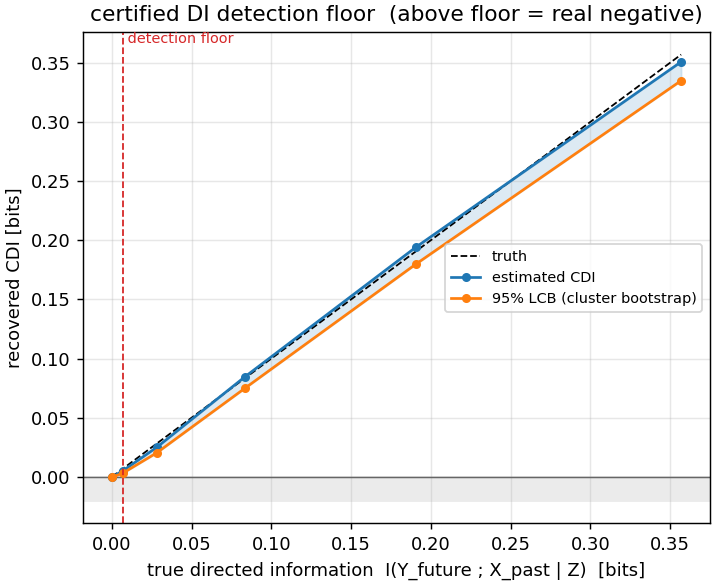
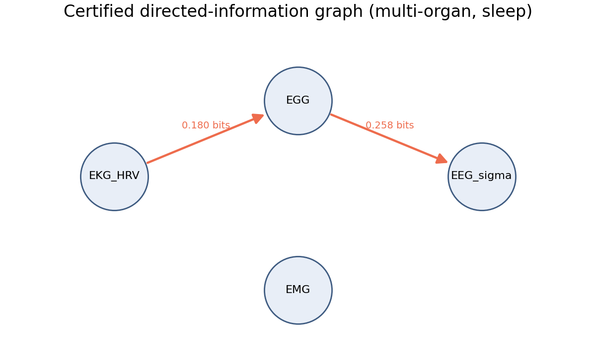
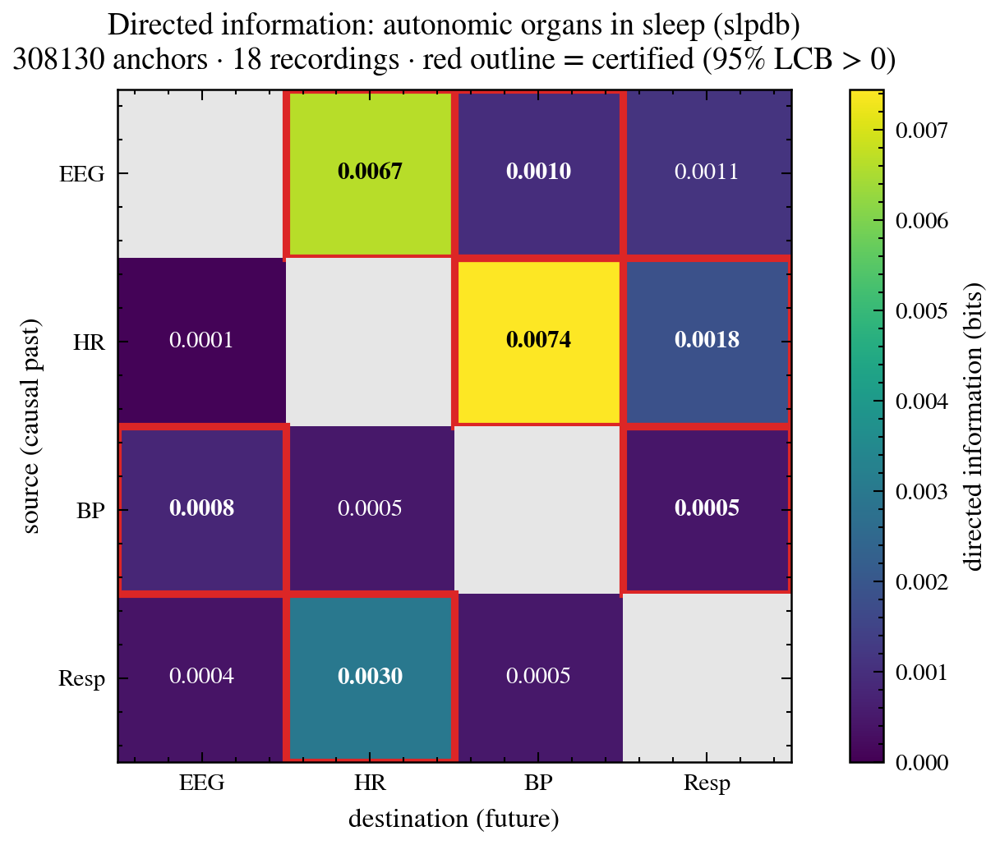
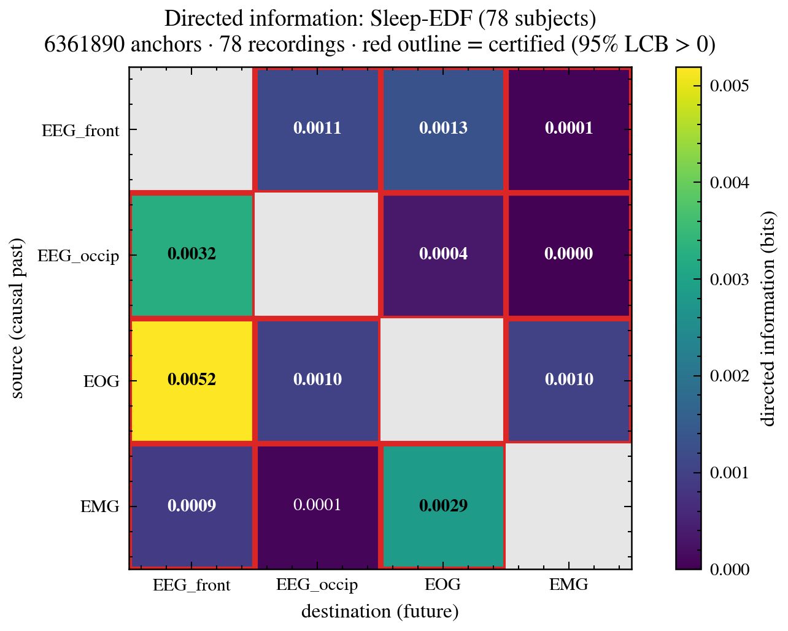
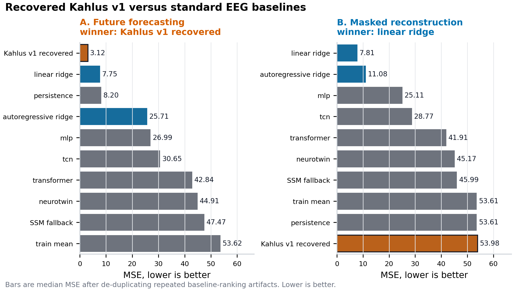

# neuroforecast

**Certified causally-conditioned directed-information graphs for multi-organ
neural coupling.** A finite-sample, leakage-controlled implementation of directed
information graphs [Quinn, Kiyavash & Coleman, *IEEE TIT* 2015] that separates
**direct** from **mediated** coupling and certifies each edge with a bootstrap
lower bound and a detection-power floor.

---

## The headline result

One table, from the benchmark's confounder and mediation scenarios. Every method
below has full detection power on the true edge; the column that separates them is
how often they **falsely certify** an edge that carries zero directed information.

| method | detects the real edge | false-certifies a null edge | mediated edge called direct |
| --- | --- | --- | --- |
| pairwise correlation | yes | **95%** | **100%** |
| pairwise transfer entropy | yes | 44% | -- |
| **neuroforecast (conditional DI)** | yes | **0%** | **0%** |

Same detection power, opposite honesty. A pairwise method buys its sensitivity by
inventing edges; conditioning on the rest of the system gets the same detection
for free. Numbers are scored independently by
[kahlus-bench](https://github.com/ptlnextdoor/kahlus-bench) at n=30 draws, 4096
samples, seed 0 (see [Independent benchmark](#independent-benchmark)).

## Why this exists

Recent work on simultaneous stomach–brain electrophysiology in human sleep
(Rao et al., "Dynamic stomach-brain electrical coupling during human sleep," 2026)
states its own methodological gap directly:

> *"These analyses are inherently correlational, precluding inference about
> directionality. Future work can employ passive causal inference methods on
> simultaneously recorded waveforms … such as Granger causality or directed
> information."*

The coupling results there are cross-correlation and phase-amplitude coupling.
This repository is that named next step — directed information — built to be
**finite-sample-certified** and **multi-organ**, so a directed edge comes with an
honest statement of whether it is real or merely underpowered.

## The estimand

For simultaneously recorded signals $\{X_1,\dots,X_m\}$, the directed edge
$i \to j$ is the causally-conditioned directed information

$$\mathrm{DI}(i \to j \,\|\, \text{rest}) \;=\; I\big(X_j(t)\,;\,X_i(\text{past}) \,\big|\, X_j(\text{past}),\, X_{k\neq i,j}(\text{past})\big).$$

Conditioning on **all other organs' pasts** is what distinguishes a *direct* edge
from one *mediated* through a third organ: if $X_i$ influences $X_j$ only via
$X_k$, then conditioning on $X_k$'s past drives $\mathrm{DI}(i\to j\,\|\,\text{rest})$
to zero — while a pairwise correlation, PAC, or even a pairwise transfer entropy
still lights up.

Two honesty guarantees:

1. **Cross-fitted estimation** — each edge is the held-out predictive
   log-likelihood gain of a model given $(X_i,\text{rest})$ over one given
   $\text{rest}$ alone, so an uninformative channel contributes $\approx 0$, not a
   positive bias. For a fixed model class the estimate is a *lower bound* on the
   true DI.
2. **A certified detection floor** — a subject/record-cluster bootstrap gives a
   one-sided 95% lower bound; a calibration injects *known* DI at graded strengths
   and reports the smallest true value whose bound clears zero. Below that floor a
   null is uninformative; above it, a null is a real negative.

Both linear (cross-fitted ridge plug-in) and neural (causal TCN + held-out
residual variance) estimators are provided; both are checked against the
closed-form linear-Gaussian DI.

---

## It works — validated against analytic ground truth

The estimator recovers the closed-form DI of a linear-Gaussian VAR, reads $\approx 0$
on a null channel, and its detection floor is explicit:



On a chain $A\to B\to C$ it recovers the two direct edges and **drives the
mediated $A\to C$ edge to zero**, while a pairwise (correlation-style) view
certifies $A\to C$ *spuriously*:



---

## It runs on real multi-organ recordings

**Autonomic organs during sleep** (MIT-BIH Polysomnographic Database, `slpdb`:
EEG, heart rate, arterial BP, respiration; 18 recordings, ~308k anchors). The
certified graph recovers *known* autonomic couplings **with direction** —
respiration→heart-rate (respiratory sinus arrhythmia), heart-rate→BP — and finds
a certified **top-down EEG→heart-rate** edge while heart-rate→EEG does **not**
clear the floor. That directional asymmetry is exactly what correlation and PAC
cannot resolve.



*(rows = source / causal past, columns = destination / future; red outline =
certified, bootstrap 95% LCB > 0; diagonal masked.)*

For reference, the same pipeline on Sleep-EDF channels (frontal/occipital EEG,
EOG, EMG; 78 subjects, 6.4M anchors) — a within-brain/eye/muscle system:



---

## Direct line to the stomach–brain data

The estimator is signal-agnostic. Point it at a stomach–brain recording with
`Y_future = future cortical state`, `X_past = gastric (EGG) history`,
`Z = (cortical history, other organs, time)`, and `clusters = subject`, and it
certifies **how many bits the gastric rhythm contributes to the future cortical
state, conditioned on the cortex's own past** — the directional statement the 2026
paper's Section 3.6 leaves open. The same estimand applies to the cephalic-phase
efferent (brain→gut) question in the lab's Parkinson's program.

## Honest scope

- Effects on the public data above are **small** (sub-0.01 bits); at hundreds of
  thousands of anchors "certified" is an easy bar. The contribution is the
  **directionality + the direct-vs-mediated distinction + the certification**, not
  the magnitude.
- Directed information is not new, and the graph formulation is Quinn–Kiyavash–
  Coleman (2015). What is here: a **finite-sample-certified, multi-organ**
  implementation with a detection-power floor, validated end-to-end.
- The stomach–brain result requires the corresponding recordings; this repo
  demonstrates the method and its validation, not that result.

## Independent benchmark

neuroforecast is scored as an external method by
[kahlus-bench](https://github.com/ptlnextdoor/kahlus-bench), a leakage-sealed
benchmark that certifies neural-coupling estimators against synthetic
ground-truth systems. On the benchmark's confounder and mediation scenarios,
neuroforecast certifies **0%** false edges at full detection power, where
pairwise correlation false-certifies up to ~95% of null edges. The benchmark
reads ground truth; the estimator never does — so the pass is an independent
check, not a self-report.


*Across the coupling sweep, neuroforecast (conditional DI) and pairwise methods
reach the same detection power on the true edge, but only the pairwise methods
climb a false-positive rate on the null edges. Figure and CSVs are reproducible
from the [kahlus-bench](https://github.com/ptlnextdoor/kahlus-bench) repo.*

## Run it

```bash
pip install -e .          # core (numpy, scipy, scikit-learn) — linear + graph
pip install -e ".[dev]"   # + torch, matplotlib, data loaders for the neural estimator and figures

pytest tests/test_linear.py    # linear DI vs analytic ground truth
pytest tests/test_graph.py     # graph: recovers structure, kills the mediated edge
python experiments/run_slpdb_graph.py --max-records 18   # the autonomic graph above
```

The core install has no torch dependency; only the neural estimator and the
data-loading experiments need the `[dev]` (or `[neural]` / `[data]`) extras.

Layout: `neuroforecast/` (`linear.py`, `neural.py`, `graph.py`, `calibration.py`),
`experiments/` (runners + figures), `tests/` (analytic-validation gates).

## Reference

Quinn, Kiyavash, Coleman. *Directed Information Graphs.* IEEE Transactions on
Information Theory, 61(12), 2015.

## Related: the latent-field engine

neuroforecast is the coupling-estimator lane. The forecasting/model lane is
[Kahlus-V1](https://github.com/ptlnextdoor/Kahlus-V1), a leakage-controlled
neural-translation benchmark and model scaffold. Its honest headline is a split
verdict: the recovered Kahlus v1 model wins future forecasting but loses masked
reconstruction to a linear ridge, and the benchmark reports both.



Happy to walk through either.
